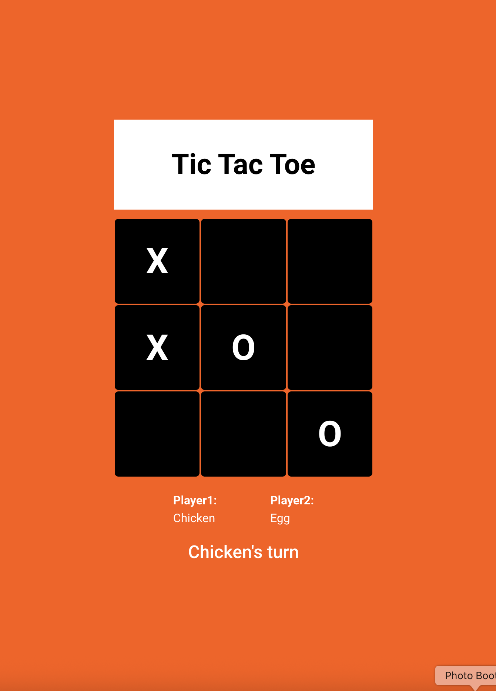

# Tic Tac Toe (The Odin Project)

## Description
A simple two-player Tic Tac Toe game playable in the browser.
Built using modular JavaScript (IIFEs and factory functions), with a responsive interface and clean interactive UI.

This project is part of The Odin Project — Advanced JavaScript course.

## Features
- Player setup menu with custom name input
- Fully interactive, JavaScript-rendered game board
- Visual indicator showing whose turn it is
- End-game detection for win or tie
- Winning line rendering to mark winning combination
- End game options: reset board - play again with same players, new game - restart from player setup

## Tech stack
- HTML5 - Basic structure
- Javascript - game logic, UI rendering, module pattern
- CSS - responsive layout, variables, custom UI styling

## Screenshot
